# J200无人机四目鱼眼模组标定教程

本文用于说明 J200 无人机四目鱼眼模组的完整标定流程，包括环境准备、`rosbag` 录制、Kalibr 标定、NX 端参数部署、报告解读、IMU 联合标定技巧以及常见问题排查。建议按章节顺序执行。

## 机器分工

本文中的步骤分成两台机器执行，后续命令不要混用：

- 机载电脑 / NVIDIA Orin NX：使用 `/home/nvidia/FS_J200_ws`，只负责启动相机、录制标定 `bag`、以及最终部署标定文件。
- 本地 Ubuntu / Kalibr 虚拟机：使用 `/home/rflysim/kalibr_ws` 作为 Kalibr 工作空间，所有辅助脚本和标定 `bag` 统一放在 `/home/rflysim/kalibr_ws/bag`，负责清理 `bag`、运行 Kalibr 标定、生成最终参数文件。

也就是说，机载电脑端只需要完成本文第二章的录包环节，以及第四章的参数部署和实机运行；第三章中所有 Kalibr 标定和参数生成命令都在本地 Ubuntu 虚拟机执行。

## 一、安装 Kalibr 标定软件

### 1. 准备电脑基础环境
在笔记本电脑或台式机上安装 Ubuntu 20.04 系统，以及 ROS Noetic 相关软件包。

### 2. 安装 Kalibr 软件包相关依赖项
1. 安装 GTK+ 开发文件：

```bash
sudo apt-get update
sudo apt-get install libgtk-3-dev
```

2. 安装其他可能需要的依赖项：

```bash
sudo apt-get install libwebkit2gtk-4.0-dev libjpeg-dev libtiff5-dev libgtk-3-dev libgstreamer1
```

3. 安装 `wxPython`：

```bash
python3 -m pip install wxPython
```

4. 编译 Kalibr：

```bash
# 创建 ROS 工作空间
mkdir -p ~/kalibr_ws/src
cd ~/kalibr_ws/src
catkin_init_workspace

# 将 kalibr_20250731.zip 拷贝到 ~/kalibr_ws/src 目录下并解压
cd ~/kalibr_ws
source /opt/ros/noetic/setup.bash
catkin init
catkin config --extend /opt/ros/noetic
catkin config --merge-devel # Necessary for catkin_tools >= 0.4
catkin config --cmake-args -DCMAKE_BUILD_TYPE=Release
catkin build -DCMAKE_BUILD_TYPE=Release -j4
```

---

## 二、录制标定所需 `rosbag`

### 1. 编译 ROS 工程

现在 Seeker 相机驱动、SeekVIO、VRPN、EGO-Planner 等源码已经统一集成在机载电脑的 `FS_J200_ws` 工作空间中

工作空间路径：

```bash
/home/nvidia/FS_J200_ws
```

推荐直接使用已经整理好的 `FS_J200_ws.zip` 工作空间压缩包。解压后进入工作空间编译：

```bash
# 进入已经解压好的 FS_J200_ws 工作空间
cd /home/nvidia/FS_J200_ws

# 加载 ROS Noetic 环境
source /opt/ros/noetic/setup.bash

# 编译工程。当前机载电脑 CMake 版本较新，需要加 CMake 兼容参数。
catkin_make -DCMAKE_BUILD_TYPE=Release -DCMAKE_POLICY_VERSION_MINIMUM=3.5

# 编译完成后加载当前工作空间环境
source /home/nvidia/FS_J200_ws/devel/setup.bash
```

如果遇到 `devel/env.sh` 不存在或 CMake 配置残留问题，可以先备份并清理 `build/`、`devel/` 后重新编译：

```bash
cd /home/nvidia/FS_J200_ws
mkdir -p .remote_backups
ts=$(date +%Y%m%d_%H%M%S)

if [ -d build ]; then
  mv build .remote_backups/build_before_clean_compile_$ts
fi

if [ -d devel ]; then
  mv devel .remote_backups/devel_before_clean_compile_$ts
fi

source /opt/ros/noetic/setup.bash
catkin_make -DCMAKE_BUILD_TYPE=Release -DCMAKE_POLICY_VERSION_MINIMUM=3.5
```

编译完成后可以检查：

```bash
test -f /home/nvidia/FS_J200_ws/devel/setup.bash && echo OK
rospack find seeker
```
### 2. 硬件连接
1. 使用 USB 3.0 Type-C 线连接 NX。
2. 设置设备权限，增加 `udev` 规则：

```bash
sudo vim /etc/udev/rules.d/99-seeker.rules
```

添加以下内容：

```bash
SUBSYSTEM=="usb", ATTR{idVendor}=="2207", ATTR{idProduct}=="0000", MODE="0666"
```

如下图所示：

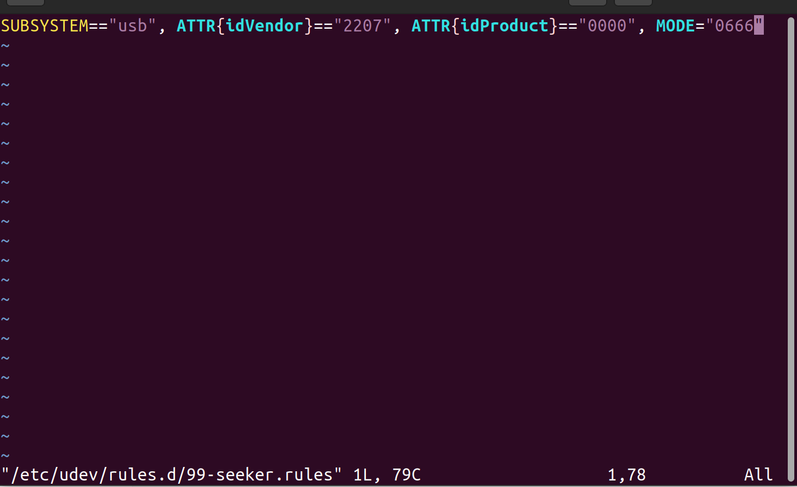

3. 重新加载 `udev` 规则，然后重新插拔设备线：

```bash
sudo udevadm control --reload && sudo udevadm trigger
```

### 3. 启动四目鱼眼相机
1. 在终端 1 输入以下命令，打开鱼眼相机：

```bash
source /home/nvidia/FS_J200_ws/devel/setup.bash
roslaunch seeker 1seeker_nodelet.launch
```


显示以下信息代表相机启动正常。如果出现 `No Seeker Devices Found`，请检查 USB 线连接是否正常，以及 `udev` 规则是否配置成功。

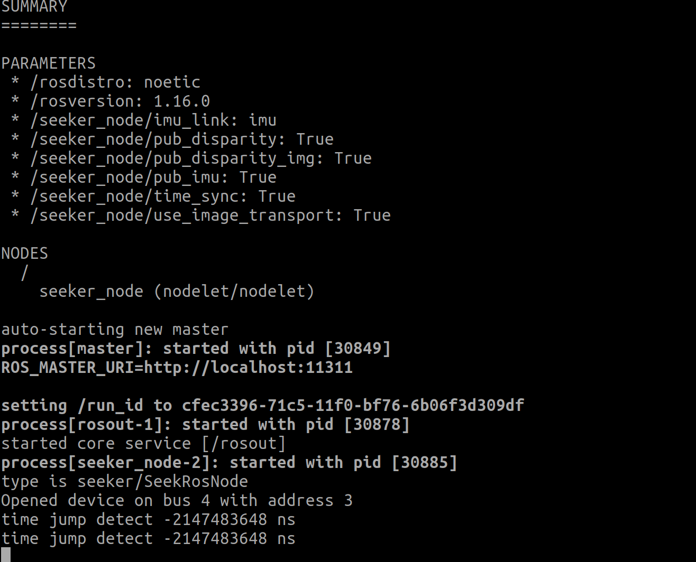

2. 在终端 2 中打开 `rqt` 可视化软件，在菜单栏依次选择 `Plugins -> Visualization -> Image Viewer`，即可显示四目鱼眼相机画面，如下图所示：

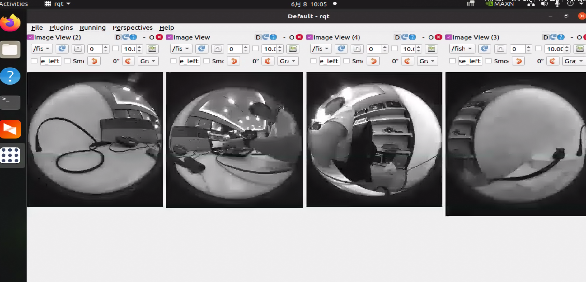

3. 出厂标定时，为了保证更好的标定效果，建议优先使用棋盘格进行标定。棋盘格规格为 `GP650-12*9-50`，小方格边长为 5 cm，如下图所示：

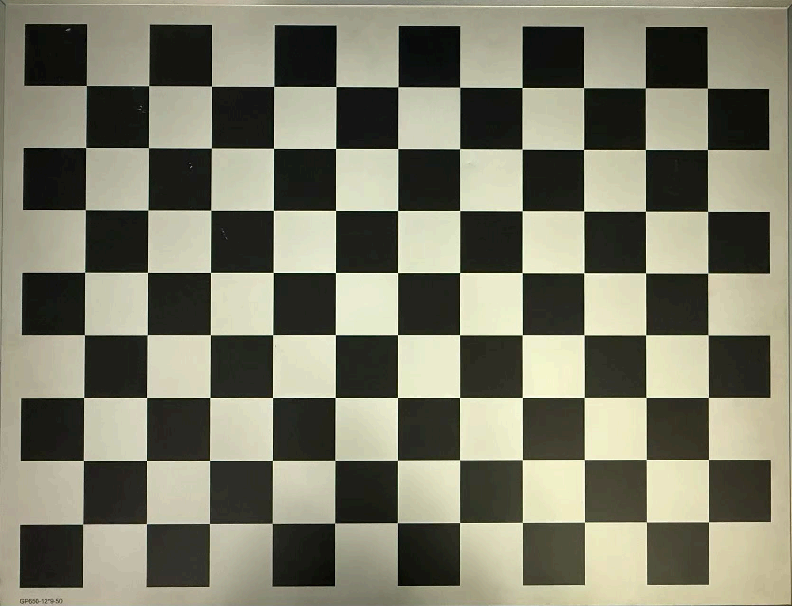

4. 如果没有专业标定板，也可以在电脑屏幕上显示 AprilGrid 图案进行标定。建议使用非曲面屏，并打开 `april_6x6_80x80cm_A0.pdf` 文件：

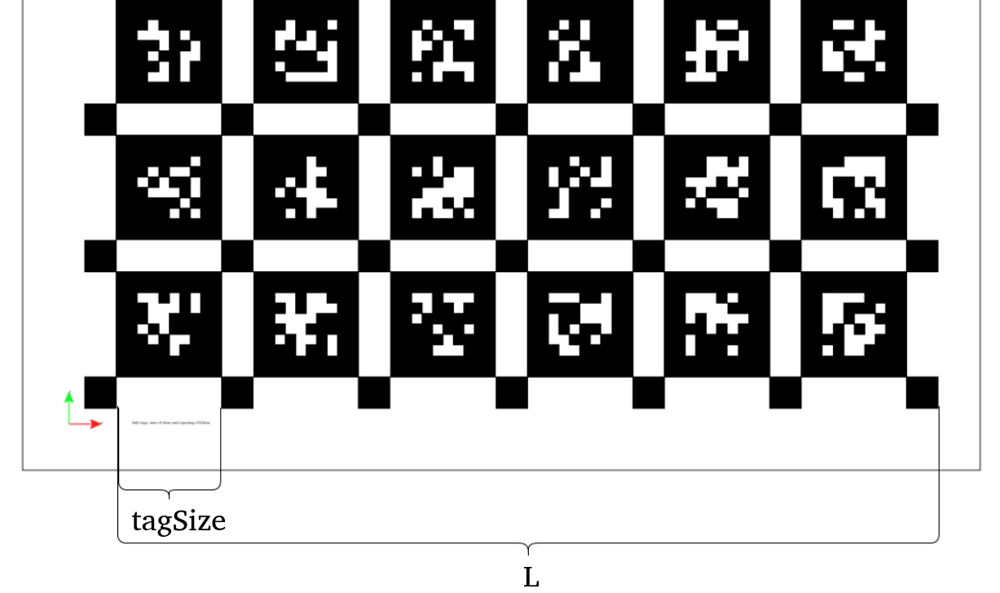

测量屏幕上 `L` 的实际长度，单位为米。`tagSize = L / 6 / 1.3`。将计算得到的 `tagSize` 值填入 `~/kalibr_ws/src/kalibr/dynamic/april_6x6_80x80cm.yaml` 文件中，示例如下：

```yaml
target_type: 'aprilgrid'  # gridtype
tagCols: 6                # number of apriltags
tagRows: 6                # number of apriltags
tagSize: 0.03724          # size of apriltag, edge to edge [m]
tagSpacing: 0.3           # ratio of space between tags to tagSize
```

5. 将四个鱼眼轮流对准棋盘格或屏幕上的 AprilGrid 区域，录制四个鱼眼相机的话题。推荐优先使用“方法 A”的同步录制脚本；如果需要完整保留原始高频数据，再使用“方法 B”的旧方法手动录制。

> 注意：请严格按照以下话题顺序录制，并保证从上向下看为顺时针排布。

#### 方法 A：推荐方法，使用同步录制脚本直接生成 5 Hz 同步 bag

适用场景：后续直接用于 Kalibr 四目鱼眼标定，希望四路图像已经近似同步，并且输出频率固定为 5 Hz。

同步录制脚本位置：

```text
/home/nvidia/FS_J200_ws/src/seeker_ws/src/seeker1/script/record_synced_fisheye.py
```

需要先确保脚本有执行权限：

```bash
chmod +x /home/nvidia/FS_J200_ws/src/seeker_ws/src/seeker1/script/record_synced_fisheye.py
```

当前 `FS_J200_ws.zip` 压缩包中已经包含该 launch 文件，不需要重新新建。只需要确认文件存在：

```text
/home/nvidia/FS_J200_ws/src/seeker_ws/src/seeker1/launch/record_fisheye.launch
```

文件内容应类似如下，用于核对参数是否正确：

```xml
<!-- record_fisheye.launch -->
<launch>
  <!-- 输出 bag 路径，可按实际保存位置修改 -->
  <arg name="output_bag" default="/home/nvidia/FS_J200_ws/bag/fisheye.bag"/>

  <!-- 录制参数 -->
  <arg name="output_rate" default="5.0"/>       <!-- 期望输出频率 Hz -->
  <arg name="slop"       default="0.04"/>      <!-- 近似同步容限 s -->
  <arg name="max_dt"     default="0.1"/>       <!-- 重采样最大允许偏差 s -->

  <!-- 图像话题名，需要与相机驱动发布的话题一致 -->
  <arg name="topic_left"   default="/fisheye/gray/left/image_raw"/>
  <arg name="topic_right"  default="/fisheye/gray/right/image_raw"/>
  <arg name="topic_bright" default="/fisheye/gray/bright/image_raw"/>
  <arg name="topic_bleft"  default="/fisheye/gray/bleft/image_raw"/>

  <!-- 启动同步录制节点，ROS 包名为 seeker -->
  <node pkg="seeker"
        type="record_synced_fisheye.py"
        name="fisheye_recorder"
        output="screen">

    <param name="output_bag"   value="$(arg output_bag)"/>
    <param name="output_rate"  value="$(arg output_rate)"/>
    <param name="slop"         value="$(arg slop)"/>
    <param name="max_dt"       value="$(arg max_dt)"/>

    <param name="topic_left"   value="$(arg topic_left)"/>
    <param name="topic_right"  value="$(arg topic_right)"/>
    <param name="topic_bright" value="$(arg topic_bright)"/>
    <param name="topic_bleft"  value="$(arg topic_bleft)"/>
  </node>
</launch>
```

先启动相机驱动，确认四路图像话题已经正常发布：

```bash
source /home/nvidia/FS_J200_ws/devel/setup.bash
roslaunch seeker 1seeker_nodelet.launch
```

正式录制前，建议打开 `rqt` 观察四路鱼眼图像，确认图像正常、话题顺序正确、标定板或 AprilGrid 已经进入相机视野：

```bash
rqt
```

在 `rqt` 中选择 `Plugins -> Visualization -> Image View`，分别查看以下四路话题：

- `/fisheye/gray/left/image_raw`
- `/fisheye/gray/right/image_raw`
- `/fisheye/gray/bright/image_raw`
- `/fisheye/gray/bleft/image_raw`

确认四路画面都正常后，再启动同步录制节点。

另开一个终端启动同步录制节点：

```bash
source /home/nvidia/FS_J200_ws/devel/setup.bash
roslaunch seeker record_fisheye.launch
```

如果需要临时修改输出路径或频率，可以在命令行覆盖 launch 参数：

```bash
roslaunch seeker record_fisheye.launch \
output_bag:=/home/nvidia/FS_J200_ws/bag/fisheye.bag \
output_rate:=5.0 \
slop:=0.04 \
max_dt:=0.1
```

录制完成后使用 `Ctrl+C` 正常退出，脚本会在关闭时执行 `bag.close()`，保证 `rosbag` 索引正常写入。

脚本中的 `shutdown()` 函数建议统一使用 4 个空格缩进，不要混用 tab 和空格：

```python
    def shutdown(self):
        self._shutting_down = True
        rospy.sleep(0.3)
        rospy.loginfo("[Recorder] Closing bag...")
        self.bag.close()
        rospy.loginfo("[Recorder] Done.")
```

主要参数说明：

- `output_bag`：输出 bag 文件路径。
- `output_rate`：输出频率，默认 `5.0 Hz`。
- `slop`：四路图像近似同步容限，默认 `0.04 s`。
- `max_dt`：重采样目标时间与实际同步图像组之间允许的最大偏差，默认 `0.1 s`。
- `topic_left`、`topic_right`、`topic_bright`、`topic_bleft`：四路鱼眼图像话题名。


当前推荐配置：

- `output_bag` 默认保存到 `/home/nvidia/FS_J200_ws/bag/fisheye.bag`，也可以在命令行覆盖为 `/home/nvidia/FS_J200_ws/bag/xxx.bag`。
- 四路图像话题名需要与实际 `rostopic list` 输出一致，尤其是 `bright` 和 `bleft` 两路名称。
- 当前相机驱动是否发布 `/camera_info` 不影响图像录制；脚本会优先写入图像数据。


#### 补充：同步录制 bag 中出现重复时间戳的原因和处理

如果运行 Kalibr 时出现以下错误：

```text
[TargetViewTable]: Tried to add second view to a given cameraId & timestamp.
Maybe try to reduce the approximate syncing tolerance..
```

通常说明同一个相机话题中出现了重复 `header.stamp`。重复帧大概率来自同步录制脚本中的重采样边界。以 `output_rate = 5 Hz` 为例，采样周期是 `0.2 s`。如果 `max_dt = 0.1 s`，刚好等于半个周期，同一组同步图像在边界情况下可能同时落入前后两个采样目标点的允许范围，于是同一组四路图像被写入两次。由于写入 bag 时使用的是原图的 `img.header.stamp`，Kalibr 就会看到同一个相机、同一个时间戳下有两帧图像。

机载电脑只负责录制 `fisheye.bag`。录制完成后，把 `fisheye.bag` 拷贝到本地 Ubuntu/Kalibr 虚拟机的 `/home/rflysim/kalibr_ws/bag/`，然后在本地虚拟机执行已有的四目清理脚本：

```bash
cd /home/rflysim/kalibr_ws/bag
python3 my_clera.py
```

清理完成后，后续四目标定使用清理后的 `clean_fisheye.bag`。如果使用清理后的 bag 完成 Kalibr 标定后，报告显示结果发散或外参明显不正确，应优先重新录制四目 `bag`。

后续重新录制时，建议把 `max_dt` 调小，不要设成采样周期的一半。例如 5 Hz 输出时可使用：

```bash
roslaunch seeker record_fisheye.launch max_dt:=0.03 slop:=0.02
```

当前 `FS_J200_ws.zip` 中的同步录制脚本已经随工程提供。若后续重新录制仍出现重复时间戳，优先重新录制或检查当前脚本版本，不需要在正常流程中手动新建 `record_fisheye.launch`。

#### 方法 B：旧方法/备选方法，手动录制原始 rosbag 后再清理

适用场景：需要完整保留原始话题数据，或想先录制高频原始 bag，再在本地 Ubuntu/Kalibr 虚拟机里单独做清理、抽稀和标定。

机载电脑端只负责录包：

```bash
cd /home/nvidia/FS_J200_ws
source /home/nvidia/FS_J200_ws/devel/setup.bash
mkdir -p /home/nvidia/FS_J200_ws/bag

rosbag record -O /home/nvidia/FS_J200_ws/bag/fisheye.bag \
/fisheye/gray/left/image_raw /fisheye/gray/right/image_raw \
/fisheye/gray/bright/image_raw /fisheye/gray/bleft/image_raw
```

标定过程中，尽量保证 AprilGrid 或棋盘格在相机视野中足够大。图案需要单独出现在四个鱼眼相机画面中，并覆盖两两鱼眼相机的交叠区域，共八个区域。完成标定动作后，按 `Ctrl+C` 停止录制。

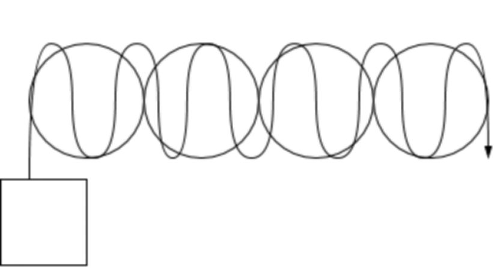

录制结束后，把 `fisheye.bag` 转移到本地 Ubuntu/Kalibr 虚拟机。传输方式不限，但最终必须放到 `/home/rflysim/kalibr_ws/bag` 目录下，并保持文件名为 `fisheye.bag`。

然后在本地虚拟机使用四目 bag 清理脚本：

```bash
cd /home/rflysim/kalibr_ws/bag
python3 my_clera.py
```

`my_clera.py` 用于四目相机标定前的常规清理、抽稀和重复时间戳处理。下面的 Kalibr 命令统一假设清理后的四目 bag 为：

```text
/home/rflysim/kalibr_ws/bag/clean_fisheye.bag
```


### 4. 录制前视双目 + IMU 联合标定 bag

这一节不属于“方法 A”或“方法 B”的四目录制方式，而是 IMU 联合标定必须单独录制的 `stereo_imu.bag`。也就是说，无论四目鱼眼 bag 使用同步录制脚本，还是使用旧方法手动录制，后续做前视双目 + IMU 联合标定时，都需要单独录制下面这个 bag。

录制过程中，使前视双目的交叠区域始终对准标定图案，并完成 XYZ 三轴平移和 roll / pitch / yaw 三轴旋转动作。完成后按 `Ctrl+C` 停止录制：

```bash
cd /home/nvidia/FS_J200_ws
source /home/nvidia/FS_J200_ws/devel/setup.bash
mkdir -p /home/nvidia/FS_J200_ws/bag

rosbag record -O /home/nvidia/FS_J200_ws/bag/stereo_imu.bag \
/fisheye/gray/left/image_raw \
/fisheye/gray/right/image_raw \
/imu_data_raw
```

录制完成后，把 `stereo_imu.bag` 转移到本地 Ubuntu/Kalibr 虚拟机。传输方式不限，但最终必须放到 `/home/rflysim/kalibr_ws/bag` 目录下，并保持文件名为 `stereo_imu.bag`。

前视双目 + IMU 联合标定前，在本地虚拟机使用 `my_clera_imu.py` 清理该 bag，后续第三章会继续说明。

---

## 三、使用 Kalibr 进行标定

本章所有命令都在本地 Ubuntu/Kalibr 虚拟机执行，不在机载电脑执行。机载电脑录完 `bag` 后，只需要把数据拷到本地虚拟机。推荐本地目录结构如下：

```text
/home/rflysim/kalibr_ws
/home/rflysim/kalibr_ws/bag
```

本地虚拟机的 `/home/rflysim/kalibr_ws/bag` 中应包含这些辅助脚本，同时录制好的四目和 IMU 标定 bag 也统一放在这个目录：

```text
3_get_undistort_kalibr_info.py
4_get_undistort_kalibr_info.py
89generate_cali.py
my_clera.py
my_clera_imu.py
```

其中：

- `my_clera.py`：用于四目相机标定 bag 的常规清理或抽稀。
- `my_clera_imu.py`：用于前视双目 + IMU 联合标定 bag 的清理。

### 1. 四目鱼眼相机标定

先在本地虚拟机清理四目 bag：

```bash
cd /home/rflysim/kalibr_ws/bag
python3 my_clera.py fisheye.bag
```

使用清理后的 bag 完成 Kalibr 标定后，应以 `clean_fisheye-report-cam.pdf` 中的重投影误差和外参结果判断质量。如果报告显示结果发散、有效共视不足或外参明显不合理，应优先重新录制四目 `bag`，而不是修改清理脚本。

下面命令假设清理后的四目 bag 路径为 `/home/rflysim/kalibr_ws/bag/clean_fisheye.bag`。由于 Kalibr 输出文件名会跟随输入 bag 文件名，使用 `clean_fisheye.bag` 标定后，输出文件也会带有 `clean_fisheye-` 前缀。加载 Kalibr 工作空间环境后，执行以下命令开始四目鱼眼标定：

```bash
# 使用棋盘格进行标定
source ~/kalibr_ws/devel/setup.bash
rosrun kalibr kalibr_calibrate_cameras \
--bag /home/rflysim/kalibr_ws/bag/clean_fisheye.bag \
--topics /fisheye/gray/left/image_raw /fisheye/gray/right/image_raw \
/fisheye/gray/bright/image_raw /fisheye/gray/bleft/image_raw \
--models omni-radtan omni-radtan omni-radtan omni-radtan \
--target /home/rflysim/kalibr_ws/src/kalibr/dynamic/checkerboard.yaml

# 使用 AprilGrid 进行标定
source ~/kalibr_ws/devel/setup.bash
rosrun kalibr kalibr_calibrate_cameras \
--bag /home/rflysim/kalibr_ws/bag/clean_fisheye.bag \
--topics /fisheye/gray/left/image_raw /fisheye/gray/right/image_raw \
/fisheye/gray/bright/image_raw /fisheye/gray/bleft/image_raw \
--models omni-radtan omni-radtan omni-radtan omni-radtan \
--target /home/rflysim/kalibr_ws/src/kalibr/dynamic/april_6x6_80x80cm.yaml
```

标定结束后，会得到标定文件 `clean_fisheye-camchain.yaml` 和 `clean_fisheye-report-cam.pdf`。打开 `clean_fisheye-report-cam.pdf` 后，可根据四个鱼眼相机的重投影误差判断标定质量：

- 使用棋盘格时，重投影误差基本在 `±0.5 px` 左右可视为标定成功；若明显大于该值，建议重新录制 `rosbag`。
- 使用屏幕上的 AprilGrid 时，重投影误差基本在 `±1 px` 左右可视为标定成功；若明显大于该值，同样建议重新录制 `rosbag`。

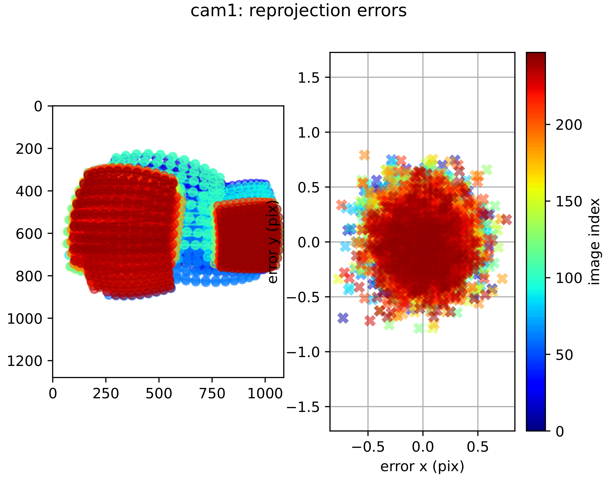

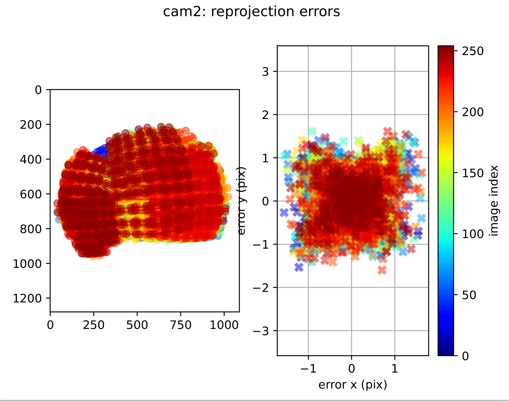

### 2. 前视双目 + IMU 联合标定

1. 将上一步得到的 `clean_fisheye-camchain.yaml` 复制一份并重命名为 `front.yaml`。四目标定命令中的话题顺序是：

```text
cam0 = /fisheye/gray/left/image_raw
cam1 = /fisheye/gray/right/image_raw
cam2 = /fisheye/gray/bright/image_raw
cam3 = /fisheye/gray/bleft/image_raw
```

因此用于前视双目 + IMU 联合标定时，只保留 `cam0` 和 `cam1`，删除 `cam2` 和 `cam3`。

2. 前视双目 + IMU 联合标定的 bag 使用 `my_clera_imu.py` 清理。在本地虚拟机运行 `my_clera_imu.py` 清理 `stereo_imu.bag`，使用清理后的 `clean_stereo_imu.bag` 进行双目 + IMU 联合标定。由于输入 bag 名为 `clean_stereo_imu.bag`，Kalibr 标定输出文件也会带有 `clean_stereo_imu-` 前缀：

```bash
cd /home/rflysim/kalibr_ws/bag
python3 my_clera_imu.py
```

3. 运行 Kalibr 联合标定：

```bash
# 使用棋盘格进行标定
source ~/kalibr_ws/devel/setup.bash
rosrun kalibr kalibr_calibrate_imu_camera \
--bag /home/rflysim/kalibr_ws/bag/clean_stereo_imu.bag \
--cam /home/rflysim/kalibr_ws/bag/front.yaml \
--imu /home/rflysim/kalibr_ws/src/kalibr/dynamic/seeker_imu.yaml \
--target /home/rflysim/kalibr_ws/src/kalibr/dynamic/checkerboard.yaml \
--timeoffset-padding 0.2

# 使用 AprilGrid 进行标定
source ~/kalibr_ws/devel/setup.bash
rosrun kalibr kalibr_calibrate_imu_camera \
--bag /home/rflysim/kalibr_ws/bag/clean_stereo_imu.bag \
--cam /home/rflysim/kalibr_ws/bag/front.yaml \
--imu /home/rflysim/kalibr_ws/src/kalibr/dynamic/seeker_imu.yaml \
--target /home/rflysim/kalibr_ws/src/kalibr/dynamic/april_6x6_80x80cm.yaml \
--timeoffset-padding 0.2
```

标定结束后，会得到以下文件：

- `clean_stereo_imu-camchain-imucam.yaml`
- `clean_stereo_imu-report-imucam.pdf`
- `clean_stereo_imu-imu.yaml`

打开 `clean_stereo_imu-report-imucam.pdf`，通过各相机的重投影误差来判断标定质量。一般来说，误差越小越好；当重投影误差超过 `±1 px` 时，建议重新录制 `rosbag` 并重新标定。

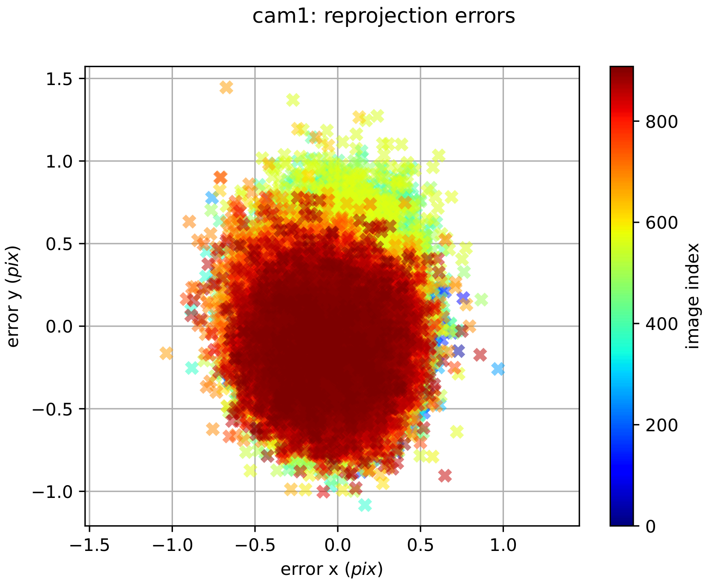

### 3. 生成最终标定文件

这一节同样在本地 Ubuntu/Kalibr 虚拟机执行，脚本和输入文件统一放在：

```text
/home/rflysim/kalibr_ws/bag
```

1. 将 `clean_fisheye-camchain.yaml` 中 `cam2` 和 `cam3` 的相关信息追加到 `clean_stereo_imu-camchain-imucam.yaml` 文件末尾。这里的 `clean_` 前缀来自前面使用清理后的 bag 进行 Kalibr 标定，是正常现象。

2. 进入 `/home/rflysim/kalibr_ws/bag` 目录，运行以下命令生成最终的 Kalibr 标定文件：

```bash
cd /home/rflysim/kalibr_ws/bag
python3 3_get_undistort_kalibr_info.py clean_stereo_imu-camchain-imucam.yaml
```

运行完成后，当前目录下会得到最终标定文件：

- `kalibr_cam_chain.yaml`
- `kalibr_imucam_chain.yaml`

3. 继续在 `/home/rflysim/kalibr_ws/bag` 目录下运行以下命令，生成 `cali` 文件：

```bash
cd /home/rflysim/kalibr_ws/bag
python3 89generate_cali.py clean_stereo_imu-camchain-imucam.yaml
```

运行完成后，会在 `/tmp` 路径下生成最终的标定文件 `cali`。

---

## 四、NVIDIA Orin NX 鱼眼相机 SDK 使用说明

### 1. 拷贝标定文件到 NX 开发板
将本地 Ubuntu/Kalibr 虚拟机中生成的标定结果：

- `kalibr_cam_chain.yaml`
- `kalibr_imucam_chain.yaml`
- `cali`

拷贝到 NX 开发板的 `/home/nvidia/FS_J200_ws/src/seeker_ws/src/seeker1/config/seeker_omni_depth` 路径下。

源文件通常位于本地虚拟机：

```text
/home/rflysim/kalibr_ws/bag/kalibr_cam_chain.yaml
/home/rflysim/kalibr_ws/bag/kalibr_imucam_chain.yaml
/tmp/cali
```

传输方式不限，可以使用 U 盘、共享文件夹、SFTP 或其他方式；只要最终文件进入 NX 的 `seeker_omni_depth` 目录即可。

### 2. 将外参信息写入相机模块
在 `/home/nvidia/FS_J200_ws/src/seeker_ws/src/seeker1/script` 目录下运行以下命令，将四目鱼眼的外参信息写入模块：

```bash
python3 /home/nvidia/FS_J200_ws/src/seeker_ws/src/seeker1/script/99set_camera_info.py \
/home/nvidia/FS_J200_ws/src/seeker_ws/src/seeker1/config/seeker_omni_depth/kalibr_cam_chain.yaml
```

### 3. 打开四目鱼眼相机和深度图

```bash
source /home/nvidia/FS_J200_ws/devel/setup.bash
roslaunch seeker 1seeker_nodelet.launch
```

### 4. 打开 VIO 功能

```bash
source /home/nvidia/FS_J200_ws/devel/setup.bash
roslaunch seeker 7vins.launch
```

---

## 五、Kalibr 联合标定报告参数解读

完成前视双目 + IMU 联合标定后，Kalibr 会生成 PDF 格式的报告文件，例如 `clean_stereo_imu-report-imucam.pdf`。该报告不仅包含误差分布，还包含外参和时间延迟等关键评估信息。以下几个参数最值得重点关注。

### 1. Reprojection Error（重投影误差）
- **含义：** 空间中真实的标定板角点，经外参矩阵和相机内参模型投影到图像平面后，与实际提取出的二维像素点之间的距离误差。
- **判断标准：** 联合标定中，平均重投影误差（Mean Reprojection Error）基本控制在 `±1.0 px` 以内即可认为合格；通常质量较好的结果在 `±0.5 px` 左右。如果误差较大或散点明显偏离中心，说明标定效果不佳，常见原因包括标定板不平整、运动导致图像模糊、外参优化未收敛等。

### 2. Camera-IMU Extrinsics（相机-IMU 外参）
报告中的 `T_cam_imu` 变换矩阵。

- **含义：** 表示 IMU 坐标系到相机坐标系的刚体变换，由一个旋转矩阵（或四元数）和一个平移向量 `t` 组成。
- **判断标准：** 重点检查平移向量 `t` 的数值是否与相机和 IMU 之间的实际安装距离大致一致。如果输出结果与卡尺测得的物理距离差异很大，例如实际只有 5 cm、结果却达到 30 cm，那么大概率是标定失败，常见原因是 `tagSize` 或棋盘格尺寸配置错误导致尺度漂移。

   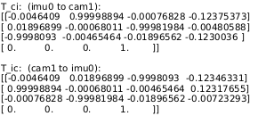

### 3. Time Delay（时间延迟 / 相机-IMU 时间偏移）
- **含义：** 用于描述相机与 IMU 时间戳之间的偏差。由于相机曝光和数据链路可能存在延迟，Kalibr 会估计两者之间的时间偏移，用于后续 VIO 中的时间同步补偿。
- **判断标准：** 时间延迟通常在几毫秒到几十毫秒范围内浮动。如果估计出的时间差非常大，例如超过 `0.1 s`，甚至逼近 `timeoffset-padding` 的设置上限，通常说明硬件时间戳不同步，或者录制过程中发生了明显掉帧。

   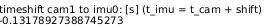

### 4. IMU Noise Parameters（IMU 噪声与常值偏置 Bias）
- **含义：** 报告中会展示 IMU 运动期间加速度计和陀螺仪偏置（Bias）的估计收敛曲线。
- **判断标准：** 如果 Bias 曲线在优化迭代过程中逐渐趋于平稳，说明标定过程较稳定；如果曲线剧烈震荡且长期不收敛，则通常表示 IMU 数据噪声过大、动作激励不足，或者输入的 `seeker_imu.yaml` 中噪声参数设置过小。

   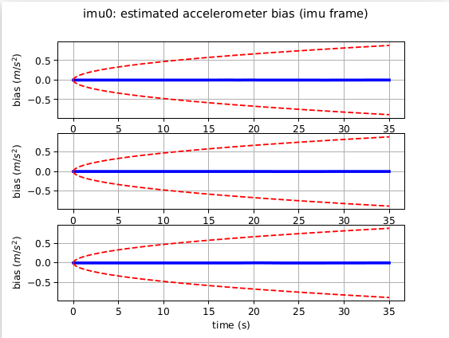

### 5. Comparison of Predicted and Measured Specific Force（预测值与实测比力对比）
- **含义：** 这一部分用于对比“由当前标定结果和运动状态反推出的加速度计理论比力”和“IMU 实际测得的比力”是否一致。这里的比力可以理解为加速度计实际感受到的量，通常包含运动引起的加速度以及重力在 IMU 坐标系下的投影。
- **判断标准：** 如果标定结果正确、时间同步正常、IMU 噪声模型合理，那么 `predicted` 和 `measured` 两组曲线在整体趋势上应高度一致，峰值和波谷位置基本对齐，只存在少量噪声级别的抖动。若两组曲线长期偏离明显，或者在运动剧烈时始终无法对齐，通常说明以下问题之一：
  - `seeker_imu.yaml` 中噪声参数设置不合理；
  - 录制 `bag` 时动作过猛，导致模型拟合效果变差。

- **实践经验：** 如果两组曲线明显反向，很有可能是 `/imu_data_raw` 话题的坐标系存在问题。此时应优先检查坐标轴定义；若不满足下列条件，建议先修改 `seeker_nodelet.cpp` 中的坐标系定义，再重新标定。
- `Z` 轴：将 IMU 水平正放（镜头水平向前，IMU 顶部朝上），正常输出应接近 `+9.8 m/s^2`。
- `X` 轴：将设备向右侧翻转 90°，使 `x` 轴指向地面，正常输出应接近 `+9.8 m/s^2`；若读数接近 `-9.8 m/s^2`，说明 `x` 轴方向定义反了。
- `Y` 轴：将设备前倾，使 `y` 轴指向地面，正常输出应接近 `+9.8 m/s^2`。

   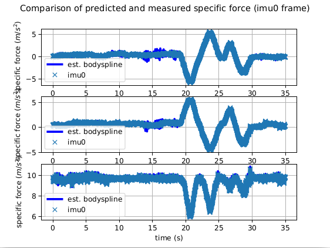

---

## 六、IMU 联合标定技巧

如果纯相机标定已经正常，但加入 IMU 后联合标定发散，通常不是 Kalibr 本身不可用，而是输入数据质量、时间同步或 IMU 先验配置存在问题。建议按以下顺序排查，而不是反复尝试同一份 `bag` 文件。

### 1. 先保证纯相机标定结果过关
在做前视双目 + IMU 联合标定之前，应先确保纯相机阶段的重投影误差已经达到前文标准。如果纯相机标定本身就不稳定，或者外参明显不合理，那么加入 IMU 后优化更容易发散。纯相机标定通常相对更容易达标；如果误差始终无法满足要求，一般是录制 `bag` 的手法不合适，应先规范录制动作。

### 2. 录制标定 `bag` 时动作要“慢、稳、全”
1. 纯相机标定 `bag` 录制要求：
   - 录制动作尽量缓慢，避免图像模糊。
   - 在交叠区域录制时，要保证标定板完整且同时出现在两个相机画面中。
   - 数据中需要同时包含 **XYZ 三轴平移** 和 **roll / pitch / yaw 三轴旋转**，每个动作做两遍即可。

2. IMU 联合标定 `bag` 录制要求：
   - 动作要尽量缓慢，避免图像模糊、角点提取不稳，或 IMU 短时数据过于剧烈。
   - 标定过程中，要让标定板始终同时出现在前视双目的重叠视野内，避免长时间只被单个相机看到。
   - 数据中同样需要包含 **XYZ 三轴平移** 和 **roll / pitch / yaw 三轴旋转**，让相机和 IMU 都获得充分激励；通常每类动作做一遍即可，数据量过大会反而影响收敛。

### 3. `seeker_imu.yaml` 参数调整放在重录之后

当前经验是：只要先用 `my_clera.py` 或 `my_clera_imu.py` 清理过一遍 `bag`，并且标定动作没有明显失误，Kalibr 通常不会发散。因此判断点应放在 Kalibr 标定完成后的报告和结果上：如果报告显示发散，或者标定结果明显不正确，不建议第一时间修改 IMU 噪声参数，而应先重新录制一次 `bag`。

推荐优先级如下：

1. 先确认已使用对应清理脚本：四目标定用 `my_clera.py`，前视双目 + IMU 联合标定用 `my_clera_imu.py`。
2. 如果使用清理后的 bag 跑完 Kalibr 后，报告显示发散或结果明显不正确，优先重新录制一次，重点检查标定板是否完整、动作是否慢稳、前视双目是否始终有足够共视。
3. 如果第二次重新录制并清理后仍然不行，再考虑修改 `/home/rflysim/kalibr_ws/src/kalibr/dynamic/seeker_imu.yaml` 中的 IMU 噪声参数。

可以优先检查或调整的参数是加速度计噪声密度：

```yaml
# /home/rflysim/kalibr_ws/src/kalibr/dynamic/seeker_imu.yaml
rostopic: /imu_data_raw
update_rate: 200.0 #Hz

accelerometer_noise_density: 0.09 #continous
accelerometer_random_walk: 0.05

gyroscope_noise_density: 0.06 #continous
gyroscope_random_walk: 0.001
```

注意：调整 `accelerometer_noise_density` 属于第二次录制仍不收敛后的排查手段，不是常规第一步。正常情况下，清理后的有效数据配合正确录制手法，应能完成联合标定。

### 4. Kalibr 节点运行参数设置
- `--bag-from-to` 参数设置：

联合标定时，`bag` 数据量过大可能导致标定难以收敛，因此建议将有效播放时长控制在 30 至 35 秒以内。相关讨论可参考 [Kalibr issue #231](https://github.com/ethz-asl/kalibr/issues/231)。

一方面可以通过精简录制动作减少数据量，另一方面也可以使用 `--bag-from-to` 参数限制播放时间：

```bash
source ~/kalibr_ws/devel/setup.bash
rosrun kalibr kalibr_calibrate_imu_camera \
--bag /home/rflysim/kalibr_ws/bag/clean_stereo_imu.bag \
--cam /home/rflysim/kalibr_ws/bag/front.yaml \
--imu /home/rflysim/kalibr_ws/src/kalibr/dynamic/seeker_imu.yaml \
--target /home/rflysim/kalibr_ws/src/kalibr/dynamic/checkerboard.yaml \
--timeoffset-padding 0.2 --bag-from-to 5 40
```

---

## 七、常见问题

### 1. 优化器发散或崩溃
- **现象：** 进行四目鱼眼相机标定时，终端报错如下：

```text
Processed 694 views with 22 views used
[ERROR] Did not converge in maxIterations... restarting...
[WARN] Optimization diverged possibly due to a bad initialization.
```

- **原因：** 数据质量不足。多目相机之间的有效共视帧极度匮乏，例如 694 帧中只有 22 帧有效共视，导致优化约束不足，最终发散。
- **解决方法：** 必须重新录制 `bag`。可使用 `--show-extraction` 检查具体是哪一部分的视野缺失，并在录制时实时观察交叠区域，确保标定板能被两个相机同时且完整地捕捉到。

```bash
source ~/kalibr_ws/devel/setup.bash
rosrun kalibr kalibr_calibrate_cameras --bag /home/rflysim/kalibr_ws/bag/clean_fisheye.bag \
--topics /fisheye/gray/left/image_raw /fisheye/gray/right/image_raw \
/fisheye/gray/bright/image_raw /fisheye/gray/bleft/image_raw \
--models omni-radtan omni-radtan omni-radtan omni-radtan \
--target /home/rflysim/kalibr_ws/src/kalibr/dynamic/checkerboard.yaml \
--show-extraction
```

### 2. 样条系数缓冲区溢出
- **现象：** 进行前视双目 + IMU 联合标定时，终端报错如下：

```text
[aslam::Exception] ... assert(_bufferTmin <= _time.toScalar() < _bufferTmax) failed ...
Spline Coefficient Buffer Exceeded. Set larger buffer margins!
```

- **原因：** 相机和 IMU 的时间差修正超出了默认的 `0.2 s` 缓冲区范围。
- **解决方法：** 适当增大 `--timeoffset-padding` 参数，例如：

```bash
rosrun kalibr kalibr_calibrate_imu_camera \
--bag /home/rflysim/kalibr_ws/bag/clean_stereo_imu.bag \
--cam /home/rflysim/kalibr_ws/bag/front.yaml \
--imu /home/rflysim/kalibr_ws/src/kalibr/dynamic/seeker_imu.yaml \
--target /home/rflysim/kalibr_ws/src/kalibr/dynamic/checkerboard.yaml \
--timeoffset-padding 0.5
```

> 注意：`padding` 过大可能会导致标定时间明显增长，且结果变差。如果设置为 `0.5` 后仍然报同样的错误，应优先检查 `bag` 的录制质量和时间同步情况。

### 3. 标定得到的相机基线（Baseline）远超物理真实尺寸
- **现象：** 标定完成后输出的基线明显异常，例如：

```text
# 实际物理距离可能仅 12cm，但输出日志计算出的 t 向量长达 30cm：
baseline T_1_0:
   t: [ 0.21269,  0.08953, -0.19854]
```

- **原因：** 算法依赖的物理先验出现错误，通常是 `checkerboard.yaml` 或 `april_6x6_80x80cm.yaml` 中的标定板物理尺寸填写错误。
- **解决方法：** 使用卡尺重新测量单个黑白方格的边长，或 AprilGrid 单个标签的实际尺寸，并更新配置文件后重新标定。
---

## 八、PX4 参数文件导入

当前 J200 环视无人机已经调试过一份可用的 PX4 参数文件：

```text
J200环视-最新参数.params
```

拿到该文件后，建议直接通过 QGroundControl 导入并刷入 PX4，不需要手动逐项修改参数。这个参数文件主要用于保证 PX4 侧和当前 SeekVIO、MAVROS、EGO-Planner、px4ctrl 实机链路匹配。

推荐操作流程：

1. 使用 QGroundControl 连接 PX4 飞控。
2. 进入参数页面，使用参数导入功能加载 `J200环视-最新参数.params`。
3. 导入后按 QGC 提示写入参数。
4. 写入完成后重启飞控，再重新连接 QGC 检查参数是否保持。
5. 参数刷入完成后，再执行后续 SeekVIO + MAVROS + EGO-Planner + px4ctrl 全流程启动。

注意：该参数文件是当前已调试过并且表现可用的版本。除非后续明确要重新调 PX4 EKF、外部视觉融合、串口/MAVLink 或控制相关参数，否则不要随意覆盖或手动改动大量 PX4 参数。

---
## 九、SeekVIO + MAVROS + EGO-Planner + px4ctrl 全流程启动

本章用于说明标定和参数部署完成后，如何在机载电脑上启动完整实机链路。当前推荐优先使用一键脚本：先把 MAVROS、Seeker 相机、SeekVIO、VIO 到 PX4 的视觉位姿转发、EGO-Planner、px4ctrl 和调试录包窗口全部拉起来；确认话题稳定后，再手动起飞、在 RViz 中给目标点、最后手动降落。

当前推荐配置为：

```text
定位源 raw odom        = /seekvio/odomimu
EGO/px4ctrl odom      = /seekvio/odomimu_ros_time
EGO depth             = /front/depth/image_raw
VIO -> PX4 vision     = /mavros/vision_pose/pose
EGO planner output    = /planning/pos_cmd
px4ctrl output        = /mavros/setpoint_raw/attitude
```

注意：`/seekvio/odomimu` 是 SeekVIO 原始输出；`FS_J200_ego-planner.launch` 内部会启动 `seekvio_odom_retime`，把它重打系统 ROS 时间后发布为 `/seekvio/odomimu_ros_time`。EGO 和 px4ctrl 使用的是这个 retime 后的话题。

### 1. 一键启动脚本

脚本已经放在机载电脑：

```text
/home/nvidia/FS_J200_ws/shire/start_seekvio_ego_px4ctrl_full.sh
```

本地文档目录中也保留了一份同名脚本，方便后续同步维护：

```text
C:\Users\10416\Desktop\j200\start_seekvio_ego_px4ctrl_full.sh
```

在 207 机载电脑上运行：

```bash
cd /home/nvidia/FS_J200_ws/shire
chmod +x start_seekvio_ego_px4ctrl_full.sh
./start_seekvio_ego_px4ctrl_full.sh
```

默认串口设备是 `/dev/ttyTHS0`。如果飞控实际挂载为 `/dev/ttyACM0` 或 `/dev/ttyUSB0`，可以临时覆盖：

```bash
SERIAL_DEV=/dev/ttyACM0 ./start_seekvio_ego_px4ctrl_full.sh
```

如果需要给地面站转发 MAVROS GCS UDP，也可以这样运行：

```bash
MAVROS_GCS_URL=udp://@192.168.151.145:14550 ./start_seekvio_ego_px4ctrl_full.sh
```

也可以同时覆盖：

```bash
SERIAL_DEV=/dev/ttyACM0 \
MAVROS_GCS_URL=udp://@192.168.151.145:14550 \
./start_seekvio_ego_px4ctrl_full.sh
```

这个脚本不会自动解锁、不会自动起飞、不会自动发布 RViz 目标点。它只启动飞行前所需链路和调试录包窗口。

### 2. 脚本启动了哪些窗口

运行后会依次打开 9 个终端窗口。

#### 2.1 MAVROS

```bash
sudo chmod 777 /dev/ttyTHS0
roslaunch mavros px4.launch
```

作用：连接 PX4 飞控，发布 `/mavros/state`、`/mavros/imu/data`、`/mavros/local_position/pose` 等 MAVROS 话题，并接收外部视觉和控制 setpoint。

如果设置了 `MAVROS_GCS_URL`，脚本会追加：

```bash
roslaunch mavros px4.launch gcs_url:=udp://@192.168.151.145:14550
```

#### 2.2 提高 MAVROS 数据流频率

```bash
rosrun mavros mavcmd long 511 31 5000 0 0 0 0 0
rosrun mavros mavcmd long 511 105 5000 0 0 0 0 0
rosrun mavros mavcmd long 511 32 100000 0 0 0 0 0
```

作用：通过 `MAV_CMD_SET_MESSAGE_INTERVAL` 请求飞控提高关键 MAVLink 消息输出频率。`5000 us` 约等于 `200 Hz`，`100000 us` 约等于 `10 Hz`。

#### 2.3 Seeker 相机和前向深度

```bash
roslaunch seeker 4depth_image.launch
```

作用：启动 Seeker 相机节点，发布前向深度/视差和 VIO 所需图像、IMU 数据。当前 EGO 默认使用：

```text
/front/depth/image_raw
```

常用检查：

```bash
rostopic hz /front/depth/image_raw
rostopic echo -n 1 /front/depth/image_raw/header
rostopic hz /front/disparity
```

#### 2.4 SeekVIO

```bash
roslaunch seeker 7vins.launch
```

作用：启动 SeekVIO，发布原始 VIO 里程计：

```text
/seekvio/odomimu
```

常用检查：

```bash
rostopic hz /seekvio/odomimu
rostopic echo -n 1 /seekvio/odomimu/header
```

#### 2.5 VIO 转发给 PX4

```bash
roslaunch camera_pose_node vin_px4.launch delay_compensation_sec:=0.0
```

作用：启动 `camera_pose_node` 的 `vision_pose_node`，把 SeekVIO 原始 odom 转换成 PX4 外部视觉输入：

```text
/seekvio/odomimu -> /mavros/vision_pose/pose
```

`vin_px4.launch` 内部当前使用：

```text
pitch_fix_deg = 180.0
fix_on_right  = true
delay_compensation_sec = 0.0
```

常用检查：

```bash
rostopic hz /mavros/vision_pose/pose
rostopic echo -n 1 /mavros/vision_pose/pose/header
```

#### 2.6 EGO-Planner

```bash
roslaunch ego_planner FS_J200_ego-planner.launch \
raw_odom_topic:=/seekvio/odomimu \
odom_topic:=/seekvio/odomimu_ros_time \
depth_topic:=/front/depth/image_raw
```

作用：启动 EGO 建图和规划链路。这个 launch 内部包含：

```text
seekvio_odom_retime: /seekvio/odomimu -> /seekvio/odomimu_ros_time
ego_planner_node:    使用 /seekvio/odomimu_ros_time 和 /front/depth/image_raw 建图规划
traj_server:         /planning/bspline -> /planning/pos_cmd
waypoint_generator:  接收 /move_base_simple/goal
rviz:                打开可视化界面
```

常用检查：

```bash
rostopic hz /seekvio/odomimu_ros_time
rostopic hz /planning/pos_cmd
rosnode info /drone_0_ego_planner_node
```

#### 2.7 px4ctrl

```bash
roslaunch px4ctrl run_ctrl_vio.launch
```

作用：启动 px4ctrl 控制器。当前 `run_ctrl_vio.launch` 中的关键 remap 是：

```xml
<remap from="~odom" to="/seekvio/odomimu_ros_time" />
<remap from="~cmd"  to="/planning/pos_cmd" />
```

px4ctrl 主要输入输出为：

```text
输入：/seekvio/odomimu_ros_time
输入：/planning/pos_cmd
输入：/mavros/imu/data
输出：/mavros/setpoint_raw/attitude
状态：/px4ctrl/state
调试：/debugPx4ctrl
```

常用检查：

```bash
rostopic hz /px4ctrl/state
rostopic hz /mavros/setpoint_raw/attitude
rostopic echo -n 1 /px4ctrl/state
```

#### 2.8 调试录包

脚本会自动录制关键话题到：

```text
/home/nvidia/FS_J200_ws/bag/seekvio_ego_px4ctrl_full_时间戳.bag
```

录制话题包括：

```text
/seekvio/odomimu
/seekvio/odomimu_ros_time
/front/depth/image_raw
/front/disparity
/mavros/state
/mavros/imu/data
/mavros/local_position/pose
/mavros/local_position/odom
/mavros/vision_pose/pose
/mavros/setpoint_raw/attitude
/planning/pos_cmd
/planning/bspline
/move_base_simple/goal
/traj_start_trigger
/px4ctrl/state
/debugPx4ctrl
```

#### 2.9 状态检查窗口

脚本最后会打开一个循环检查窗口，持续打印关键话题、`/mavros/state` 和 `/px4ctrl/state`。这个窗口只用于观察，不参与控制。

### 3. 起飞、给目标点和降落

一键脚本启动完成后，不要马上起飞。先确认以下话题有稳定输出：

```bash
rostopic hz /seekvio/odomimu
rostopic hz /seekvio/odomimu_ros_time
rostopic hz /front/depth/image_raw
rostopic hz /mavros/vision_pose/pose
rostopic hz /px4ctrl/state
```

确认稳定后，手动起飞：

```bash
/home/nvidia/FS_J200_ws/shire/takeoff.sh
```

`takeoff.sh` 实际发布：

```bash
rostopic pub -1 /px4ctrl/takeoff_land quadrotor_msgs/TakeoffLand "{takeoff_land_cmd: 1}"
```

起飞后，在 RViz 使用 `2D Nav Goal` 或 Goal Tool 发送目标点。目标话题是：

```text
/move_base_simple/goal
```

EGO 收到目标点后会发布：

```text
/planning/bspline
/planning/pos_cmd
```

需要降落时运行：

```bash
/home/nvidia/FS_J200_ws/shire/land.sh
```

`land.sh` 实际发布：

```bash
rostopic pub -1 /px4ctrl/takeoff_land quadrotor_msgs/TakeoffLand "{takeoff_land_cmd: 2}"
```

### 4. 关键话题检查表

| 模块 | 话题 | 期望 |
| --- | --- | --- |
| Seeker 深度 | `/front/depth/image_raw` | 有稳定频率，EGO 建图输入 |
| Seeker 视差 | `/front/disparity` | 有稳定频率，深度来源 |
| SeekVIO 原始定位 | `/seekvio/odomimu` | 约 200 Hz |
| EGO/px4ctrl 定位 | `/seekvio/odomimu_ros_time` | 有稳定频率，时间戳接近 ROS 当前时间 |
| VIO 给 PX4 | `/mavros/vision_pose/pose` | 有稳定频率 |
| MAVROS 状态 | `/mavros/state` | connected 应为 true |
| EGO 输出轨迹 | `/planning/bspline` | 给目标点后发布 |
| traj_server 输出 | `/planning/pos_cmd` | 规划执行时发布 |
| px4ctrl 状态 | `/px4ctrl/state` | 有稳定输出 |
| px4ctrl 给 PX4 | `/mavros/setpoint_raw/attitude` | 起飞/控制时发布 |

常用快速检查命令：

```bash
rostopic hz /front/depth/image_raw
rostopic hz /seekvio/odomimu_ros_time
rostopic hz /mavros/vision_pose/pose
rostopic hz /planning/pos_cmd
rostopic hz /mavros/setpoint_raw/attitude
```

### 5. 时间戳同步检查

EGO 建图使用 depth 和 odom 的同步回调。当前应检查：

```bash
rostopic echo -n 1 /front/depth/image_raw/header
rostopic echo -n 1 /seekvio/odomimu_ros_time/header
```

正常情况下，两者的 `stamp.secs` 应接近同一个 ROS 时间基准。`/seekvio/odomimu_ros_time` 是给 EGO 和 px4ctrl 使用的 retime 后话题，比直接拿 `/seekvio/odomimu` 更适合与深度图同步。

### 6. 207 上现有脚本作用说明

#### 6.1 `/home/nvidia/FS_J200_ws/shire/start_seekvio_ego_px4ctrl_full.sh`

当前推荐的完整实机链路脚本。它启动 MAVROS、MAVROS 频率设置、Seeker 相机/深度、SeekVIO、VIO 到 PX4 外部视觉、EGO-Planner、px4ctrl、调试录包和状态检查窗口。它不自动起飞、不自动降落、不自动发目标点。

#### 6.2 `/home/nvidia/shfiles/e7_vins_planner_flight/e7_sensors_func.sh`

早期 E7 VIO + EGO planner offboard demo 脚本。它也会启动 MAVROS、频率设置、`4depth_image.launch`、`7vins.launch`、`vin_px4.launch` 和 EGO，但最后启动的是：

```bash
python3 e7_control.py _takeoff_z:=0.5 _planner_goal_x:=1.0 _planner_goal_y:=0.0 _planner_goal_z:=0.5 _auto_offboard:=false _auto_arm:=false
```

也就是说，这个脚本走的是 `e7_control.py` planner-to-PX4 控制逻辑，不是当前推荐的 `px4ctrl run_ctrl_vio.launch` 链路。当前要测 px4ctrl 时，优先使用 `start_seekvio_ego_px4ctrl_full.sh`。

#### 6.3 `/home/nvidia/FS_J200_ws/shire/start_vio_px4_mocap_compare_bag.sh`

用于“VIO 给 PX4，动捕只做对比”的脚本。它启动 MAVROS、频率设置、Seeker 相机、SeekVIO、`vin_px4.launch`，同时启动 VRPN 动捕客户端并录包：

```text
/vrpn_client_node/droneyee207/odometry
/mavros/local_position/pose
/seekvio/odomimu
```

注意：这个脚本不会启动 `odom2mavros_node vrpn2mavros.launch`，所以动捕不会喂给 PX4。

#### 6.4 `/home/nvidia/FS_J200_ws/shire/start_mocap_vio_compare.sh`

用于“动捕给 PX4，VIO 只做对比观察”的脚本。它会启动 VRPN client，并通过：

```bash
roslaunch odom2mavros_node vrpn2mavros.launch slam_topic:=/vrpn_client_node/droneyee207/odometry
```

把动捕转发给 MAVROS/PX4。这个脚本适合对比 VIO 与动捕/PX4 local position，不适合验证 VIO 直接喂 PX4 的链路。

#### 6.5 `/home/nvidia/FS_J200_ws/shire/start_mocap_vio_bag.sh`

用于动捕/VIO 延迟分析。PX4 定位源使用动捕，VIO 只用于对比；脚本还会启动 VIO 预测补偿话题 `/seekvio/odomimu_predicted` 并录包。这个脚本不是实飞 EGO + px4ctrl 主流程。

#### 6.6 `/home/nvidia/FS_J200_ws/shire/start_mocap_seekvio_observe_bag.sh`

只启动动捕和 SeekVIO 观察，不启动 MAVROS，不启动 `odom2mavros`，也不启动 `vin_px4`。适合手拿飞机对齐动捕和 VIO，或者只录：

```text
/vrpn_client_node/droneyee207/odometry
/seekvio/odomimu
```

#### 6.7 `/home/nvidia/FS_J200_ws/shire/takeoff.sh` 和 `land.sh`

这两个脚本只给 px4ctrl 发布起飞/降落命令：

```text
takeoff.sh -> /px4ctrl/takeoff_land: takeoff_land_cmd = 1
land.sh    -> /px4ctrl/takeoff_land: takeoff_land_cmd = 2
```

使用前提是 `px4ctrl` 已经启动，并且 `/seekvio/odomimu_ros_time`、`/mavros/imu/data` 等输入稳定。

#### 6.8 `/home/nvidia/shfiles/e7_vins_planner_flight/check_statistic.sh`

这是旧检查脚本，里面仍有旧路径 `FS-J200` 和 RealSense 相关命令。当前 J200 + Seeker + px4ctrl 主流程不推荐使用它作为启动入口。

### 7. 常见问题

#### 7.1 EGO 没有建图

检查：

```bash
rostopic hz /front/depth/image_raw
rostopic hz /seekvio/odomimu_ros_time
rosnode info /drone_0_ego_planner_node
```

如果 depth 没有输出，优先看 `4depth_image.launch` 是否正常。如果 EGO 没订阅 `/seekvio/odomimu_ros_time`，检查 `FS_J200_ego-planner.launch` 的 `odom_topic` 参数。

#### 7.2 px4ctrl 没有输出 setpoint

检查：

```bash
rostopic hz /px4ctrl/state
rostopic hz /mavros/imu/data
rostopic hz /seekvio/odomimu_ros_time
rostopic hz /planning/pos_cmd
```

px4ctrl 至少需要 odom、MAVROS IMU 和控制命令输入。没有目标点时，`/planning/pos_cmd` 可能不会持续发布。

#### 7.3 PX4 没有融合 VIO

检查：

```bash
rostopic hz /mavros/vision_pose/pose
rostopic echo -n 1 /mavros/state
```

如果 `/mavros/vision_pose/pose` 正常但 PX4 local position 不稳定，需要继续检查 PX4 EKF2 外部视觉融合参数，尤其是是否启用了 vision position/yaw 融合。

#### 7.4 RViz 给目标点后没有规划

检查 RViz 目标点是否发到了：

```text
/move_base_simple/goal
```

再检查是否有规划输出：

```bash
rostopic echo -n 1 /planning/bspline
rostopic echo -n 1 /planning/pos_cmd
```

如果没有输出，优先检查 EGO 是否已经收到有效 odom 和 depth。

### 8. 成功状态参考

下面这些现象同时满足时，说明链路基本跑通：

```text
/mavros/state connected = true
/seekvio/odomimu 有稳定输出
/seekvio/odomimu_ros_time 有稳定输出
/front/depth/image_raw 有稳定输出
/mavros/vision_pose/pose 有稳定输出
/px4ctrl/state 有稳定输出
```

RViz 给目标点后，应继续看到：

```text
/planning/bspline 有输出
/planning/pos_cmd 有输出
/mavros/setpoint_raw/attitude 有输出
```

如果达到以上状态，说明 SeekVIO、EGO-Planner、traj_server、px4ctrl 和 MAVROS setpoint 链路已经连通。


